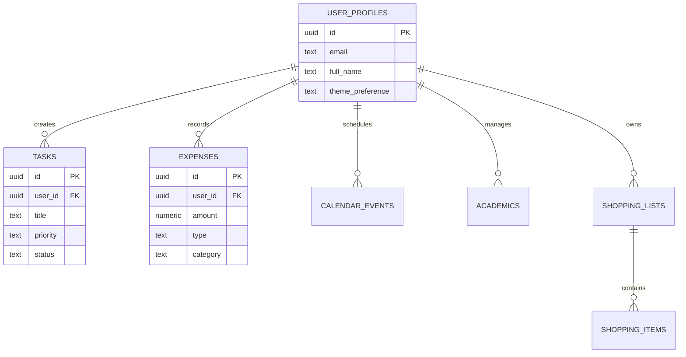

<div align="center">

# 🌟 NexLife

### *Your All-in-One Life Management Platform*

<p align="center">
  
</p>

<p align="center">
  <a href="#"></a>
  <a href="#"></a>
  <a href="#"></a>
  <a href="#"></a>
</p>

<p align="center">
  <a href="#"></a>
  <a href="#"></a>
  <a href="#"></a>
</p>

---

### ⚡ Built with cutting-edge technologies for a seamless experience

</div>

---

## ✨ Features

<table>
<tr>
<td width="50%">

### 🔐 **Authentication**
```
✓ Email/Password Login
✓ Google OAuth Integration  
✓ Secure Session Management
✓ Auto Token Refresh
```

</td>
<td width="50%">

### 📋 **Task Management**
```
✓ Create & Organize Tasks
✓ Priority Levels
✓ Status Tracking
✓ Due Date Reminders
```

</td>
</tr>

<tr>
<td width="50%">

### 💰 **Expense Tracking**
```
✓ Income/Expense Recording
✓ Category Organization
✓ Budget Calculator
✓ Indian Rupees (₹) Format
```

</td>
<td width="50%">

### 📅 **Calendar Events**
```
✓ Event Scheduling
✓ Color-Coded Events
✓ Time Management
✓ Event Reminders
```

</td>
</tr>

<tr>
<td width="50%">

### 📚 **Academics**
```
✓ Subject Management
✓ File Attachments
✓ Progress Tracking
✓ Resource Links
```

</td>
<td width="50%">

### 🛒 **Shopping Lists**
```
✓ Multiple Lists
✓ Category Items
✓ Quantity Tracking
✓ Completion Status
```

</td>
</tr>
</table>

<div align="center">

### 🎨 **Beautiful & Modern UI**


</div>

---

## 🛠️ Tech Stack

<div align="center">

<table>
<tr>
<td align="center" width="96">

<br>Next.js
</td>
<td align="center" width="96">

<br>TypeScript
</td>
<td align="center" width="96">

<br>Tailwind
</td>
<td align="center" width="96">

<br>Supabase
</td>
<td align="center" width="96">

<br>Vercel
</td>
<td align="center" width="96">

<br>PostgreSQL
</td>
</tr>
</table>

</div>

---

## 🚀 Getting Started

<details>
<summary><b>📦 Installation Steps</b></summary>

### 1️⃣ Clone the repository

```bash
git clone <your-repository-url>
cd NexLife
```

### 2️⃣ Install dependencies

```bash
npm install
```

### 3️⃣ Set up environment variables

Create a `.env` file in the root directory:

```env
NEXT_PUBLIC_SUPABASE_URL=your_supabase_project_url
NEXT_PUBLIC_SUPABASE_ANON_KEY=your_supabase_anon_key
```

### 4️⃣ Set up Supabase Database

1. Go to your Supabase Dashboard
2. Navigate to SQL Editor
3. Copy the content from `supabase/migrations/20260210171839_create_nexlife_schema.sql`
4. Paste and run the SQL to create all tables

### 5️⃣ Configure Google OAuth (Optional)

1. Go to [Google Cloud Console](https://console.cloud.google.com/)
2. Create OAuth 2.0 credentials
3. Add authorized redirect URI: `https://your-project.supabase.co/auth/v1/callback`
4. Add credentials to Supabase Dashboard → Authentication → Providers → Google

### 6️⃣ Run the development server

```bash
npm run dev
```

Open [http://localhost:3000](http://localhost:3000) to see your application.

</details>

---

## 📁 Project Structure

```
📦 NexLife
┣ 📂 app                      # Next.js app directory
┃ ┣ 📂 academics              # 📚 Academics management
┃ ┣ 📂 calendar               # 📅 Calendar events
┃ ┣ 📂 dashboard              # 🏠 Main dashboard
┃ ┣ 📂 expenses               # 💰 Expense tracking
┃ ┣ 📂 login                  # 🔐 Login page
┃ ┣ 📂 signup                 # ✍️ Signup page
┃ ┣ 📂 tasks                  # ✅ Task management
┃ ┣ 📂 shopping               # 🛒 Shopping lists
┃ ┗ 📜 layout.tsx             # Root layout
┣ 📂 components               # React components
┃ ┣ 📂 layout                 # Layout components
┃ ┗ 📂 ui                     # UI components (Radix)
┣ 📂 contexts                 # React contexts
┃ ┗ 📜 AuthContext.tsx        # Authentication
┣ 📂 lib                      # Utilities
┃ ┣ 📂 supabase               # Supabase client
┃ ┗ 📜 utils.ts               # Helpers
┣ 📂 public                   # Static assets
┗ 📂 supabase                 # Database migrations
  ┗ 📂 migrations             # SQL migrations
```

---

## 🗄️ Database Schema

<div align="center">



</div>

<p align="center"><b>🔒 All tables have Row Level Security (RLS) enabled</b></p>

---

## 🔒 Security

<div align="center">

| Feature | Status | Description |
|---------|--------|-------------|
| 🛡️ **RLS** | ✅ Enabled | Row Level Security on all tables |
| 🔐 **Auth** | ✅ Required | User authentication for operations |
| 🔄 **Sessions** | ✅ Secure | Auto token refresh & management |
| 🚪 **Routes** | ✅ Protected | Authentication checks on routes |

</div>

---

## 🌐 Deployment

<div align="center">

### 🚀 Deploy to Vercel in Minutes!

[](https://vercel.com/new/clone)

</div>

<details>
<summary><b>📘 Deployment Guide</b></summary>

### Step 1: Push to GitHub
```bash
git init
git add .
git commit -m "Initial commit"
git remote add origin <your-repo-url>
git push -u origin main
```

### Step 2: Deploy to Vercel

1. Go to [Vercel](https://vercel.com/)
2. Import your repository
3. Add environment variables:
   - `NEXT_PUBLIC_SUPABASE_URL`
   - `NEXT_PUBLIC_SUPABASE_ANON_KEY`
4. Click **Deploy** 🎉

### Step 3: Post-Deployment

- Update Supabase URL Configuration
- Add Vercel URL to Google OAuth redirect URIs

</details>

---

## 📝 Available Scripts

<div align="center">

| Command | Description | Usage |
|---------|-------------|-------|
| 🔧 `npm run dev` | Start development server | Local development |
| 🏗️ `npm run build` | Build for production | Production build |
| ▶️ `npm start` | Start production server | Run production |
| 🔍 `npm run lint` | Run ESLint | Code linting |
| 📘 `npm run typecheck` | Type checking | TypeScript check |

</div>

---

## 🤝 Contributing

<div align="center">

**Contributions are always welcome!** 💙

<table>
<tr>
<td>

1. 🍴 Fork the Project
2. 🌿 Create Feature Branch
   ```bash
   git checkout -b feature/AmazingFeature
   ```
3. 💾 Commit Changes
   ```bash
   git commit -m 'Add AmazingFeature'
   ```
4. 📤 Push to Branch
   ```bash
   git push origin feature/AmazingFeature
   ```
5. 🔃 Open Pull Request

</td>
</tr>
</table>

</div>

---

## 📄 License

<div align="center">

This project is open source and available under the [MIT License](LICENSE).


</div>

---

## 🙏 Acknowledgments

<div align="center">

<table>
<tr>
<td align="center">
<a href="https://nextjs.org/">
<br/>
<b>Next.js</b>
</a>
</td>
<td align="center">
<a href="https://supabase.com/">
<br/>
<b>Supabase</b>
</a>
</td>
<td align="center">
<a href="https://www.radix-ui.com/">
<br/>
<b>Radix UI</b>
</a>
</td>
<td align="center">
<a href="https://tailwindcss.com/">
<br/>
<b>Tailwind CSS</b>
</a>
</td>
<td align="center">
<a href="https://lucide.dev/">
<br/>
<b>Lucide Icons</b>
</a>
</td>
</tr>
</table>

</div>

---

<div align="center">

## 📧 Contact & Support

<p>For any queries or support, please open an issue in the repository.</p>

[](https://github.com/yourusername/nexlife/issues)
[](https://github.com/yourusername/nexlife/discussions)

---

### Made with ❤️ using Next.js and Supabase

<p>
  
</p>

**If you found this helpful, please consider giving it a ⭐**

---


</div>
